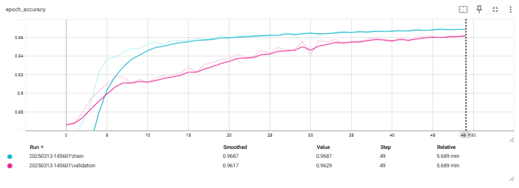

# **Image Segmentation with U-Net and MobileNetV2**

This repository contains an image segmentation model built using U-Net architecture with a MobileNetV2 backbone. The model is designed for pixel-wise classification and can be used to segment objects in images. The dataset used in this project consists of images with corresponding mask images for training and testing the model.

## **Project Description**

The project uses a U-Net architecture for semantic segmentation, a common deep learning model used for image segmentation tasks. The U-Net model is augmented with MobileNetV2 as the encoder (backbone) for feature extraction. The model is trained on a dataset containing images and their respective masks to segment out certain regions of interest in the images.

## **Libraries**

- `tensorflow`
- `keras`
- `matplotlib`
- `numpy`
- `opencv-python`
- `scikit-learn`
- `tensorflow_examples`

# **Dataset**

The dataset is taken from data source:

[Data Source](https://www.kaggle.com/competitions/data-science-bowl-2018/overview)

## **Data Preprocessing**

The dataset is loaded, preprocessed, and split into training and testing sets:

1. **Images** are read and resized to `128x128` and normalized to `[0, 1]` range.
2. **Masks** are read as grayscale images, resized to `128x128`, and normalized to binary values (0 and 1).

The data is then converted into TensorFlow datasets (`tf.data.Dataset`) and is prepared for model training.

## **Model Architecture**

The model is built using U-Net architecture with MobileNetV2 as the encoder backbone:

- The encoder (downward path) uses MobileNetV2 to extract features at different scales.
- The decoder (upward path) uses transposed convolutions to reconstruct the output segmentation mask.
- Skip connections are established between the encoder and decoder layers to preserve high-resolution features.

The final layer of the network performs pixel-wise classification of the image into different classes (in this case, binary segmentation).

## **Training**

The model is compiled with the `SparseCategoricalCrossentropy` loss function and the Adam optimizer. Training includes early stopping to avoid overfitting. The training process is also monitored through TensorBoard.

During the training, the `DisplayCallback` is used to display predictions at the end of each epoch for visual feedback.

## **Performance**

The performance of model is visualised using Tensorboard:

## **Results and Predictions**

Once the model is trained, it can be evaluated on the test set to measure its performance.

Example predictions for a test image are shown using the `show_predictions()` function, which displays the input image, true mask, and predicted mask side by side:

## **Model Saving**

After training, the model is saved as model.keras file

